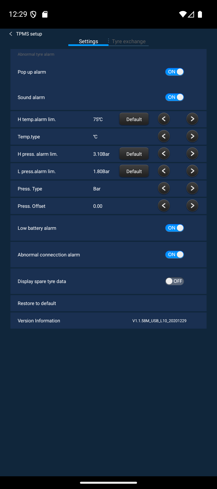

# TPMS APK — Модифицированное приложение для контроля давления шин


> Модификация оригинального TPMS приложения для Android-магнитол.  
> Добавлена калибровка давления, для устранения погрешности датчиков.

## 📦 Товар

Внешние датчики давления для Android-навигации:  
👉 **[Ozon — Внешний датчик давления шины](https://www.ozon.ru/product/vneshniy-datchik-davleniya-shiny-navigatsionnaya-sistema-android-podarok-muzhchine-2448342466/)**

**Описание товара:** Система мониторинга давления в шинах (TPMS) с внешними датчиками для Android-навигации. Совместима с головными устройствами на базе Android. Позволяет контролировать давление во всех 4 колёсах в режиме реального времени.

---

## ✨ Что изменено

### 1️⃣ Поправка давления (Pressure Offset)

- В экран настроек TPMS добавлена новая строка **"Поправка давл."**
- Значение изменяется кнопками `+` / `−` с шагом **5 KPA (= 0.05 бар)**
- Диапазон: **−200 до +200 KPA** (−2.0 до +2.0 бар)
- ✅ Поправка применяется ко всем 4 датчикам при отображении
- ✅ Значение хранится в SharedPreferences — **сохраняется после перезагрузки**
- ✅ Поддерживает единицы Bar, Psi, KPA

**Зачем это нужно?**  
Датчики часто систематически завышают или занижают значение. С помощью поправки можно откалибровать показания под реальные значения манометра.

### 2️⃣ Русская локализация

- ✅ Добавлен полный русский перевод всех строк интерфейса
- ✅ Строка "Press. Offset" переведена как **"Поправка давл."**
- Все кнопки, уведомления и статусы на русском
- Файл: `res/values-ru/strings.xml`

### 3️⃣ Автоповтор при отсутствии сигнала датчиков

- ✅ При старте приложение ждёт **8 секунд** — если датчики не ответили, перезапускает соединение
- ✅ Повторные попытки каждые **10 секунд**, максимум **20 попыток**
- ✅ Решает проблему «4 пустые плашки без связи» при загрузке магнитолы
- Реализовано в `Tpms3.smali` через `Handler.postDelayed`

### 4️⃣ Скрытие уведомления «давление в норме»

- ✅ Уведомление «давление в шинах в норме» автоматически **скрывается через 3 секунды**
- ✅ Ранее уведомление висело бесконечно
- Реализовано в `TpmsApplication.smali` + `NotifBar.smali`

### 5️⃣ Автозапуск (без изменений)

Приложение запускается автоматически при:
- 🔌 Загрузке системы (BOOT_COMPLETED)
- 🔆 Включении экрана (SCREEN_ON)
- 🚗 Включении зажигания (ACC_EVENT)
- 👤 Появлении пользователя (USER_PRESENT)

Реализовано через `BKReceiver`.

---

## 📥 Скачивание APK

[⬇️ Скачать tpms_prod_ru_signed.apk (3.5 MB)](../../releases/tpms_prod_ru_signed.apk)

---

## 🚀 Установка

> ⚠️ **Требуется:**
> - **Root доступ** ИЛИ
> - **Системная подпись** (sharedUserId="android.uid.system")

### Способ 1: ADB (если подключена к компьютеру)
```bash
adb install -r tpms_prod_ru_signed.apk
adb shell am start -n com.syt.tmps/.TpmsApplication
```

### Способ 2: Файловый менеджер (на магнитоле)
1. Скачайте `tpms_prod_ru_signed.apk` из репозитория
2. Скопируйте его на USB или microSD
3. Откройте файловый менеджер на магнитоле
4. Выберите APK и нажмите "Установить"
5. Перезагрузите устройство

### Способ 3: Через меню приложений
1. Включите "Установка из неизвестных источников" в Настройках
2. Откройте APK через менеджер приложений
3. Нажмите "Установить"

---

## 📱 Скриншот настроек (RU)



---

## 🔧 Сборка из исходников

Если хотите пересобрать APK с собственными изменениями:

```bash
# Требуется:
# - Java JDK
# - apktool.jar
# - AOSP platform ключи (platform.p12, platform.pk8, platform.x509.pem)

# 1. Собрать APK
java -jar apktool.jar b apktool_tpms-fyt -o tpms_modified.apk

# 2. Подписать platform ключом (для системных разрешений)
jarsigner -keystore platform.p12 \
  -storepass android \
  -keypass android \
  -sigalg SHA256withRSA \
  -digestalg SHA-256 \
  tpms_modified.apk platform

# 3. Выравнять (для оптимизации)
zipalign -f 4 tpms_modified.apk tpms_signed.apk
```

---

## 📋 Структура проекта

```
tpms-apk/
├── README.md                          ← Этот файл
├── .gitignore                         ← Исключает большие файлы
├── apktool_tpms-fyt/                  ← Распакованный APK (исходный код)
│   ├── res/
│   │   ├── values/strings.xml         ← Английские строки
│   │   ├── values-ru/strings.xml      ← Русские строки
│   │   └── layout/fragment_set.xml    ← UI настроек с поправкой давления
│   ├── smali/com/tpms/biz/
│   │   └── Tpms.smali                 ← Логика поправки давления
│   └── AndroidManifest.xml            ← Разрешения и компоненты
├── releases/
│   └── tpms_prod_ru_signed.apk        ← Готовый APK для установки ✅
└── images/
    ├── tpms_product.png               ← Фото товара с Ozon
    └── screen_set.png                 ← Скриншот настроек TPMS (RU)
```

---

## 🎯 Использование поправки давления

### Пример: Датчики завышают на 0.25 бар

1. Откройте **"Настройка TPMS"**
2. Найдите строку **"Поправка давл."** (по умолчанию `0.00`)
3. Нажимайте кнопку **`−`** 5 раз, чтобы установить `−0.25` Bar
4. Давление всех датчиков уменьшится на 0.25 бар
5. Значение сохранится после перезагрузки

### Диапазоны

| Единица | Диапазон | Шаг |
|---------|----------|-----|
| **Bar** | −2.0 до +2.0 | 0.05 |
| **Psi** | −29.0 до +29.0 | 0.7 |
| **KPA** | −200 до +200 | 5 |

---

## 🐛 Возможные проблемы

### Приложение не запускается
- ✅ Убедитесь, что система Android 4.3+
- ✅ Проверьте разрешение "Установка из неизвестных источников"
- ✅ Попробуйте удалить старую версию перед установкой

### Поправка не сохраняется
- ✅ Убедитесь, что приложение не запущено в режиме "только чтение"
- ✅ Проверьте разрешения на запись в памяти
- ✅ Перезагрузите систему

### Датчики не видны
- ✅ Включите Bluetooth (если используются беспроводные датчики)
- ✅ Нажмите кнопку сопряжения (ID-код)
- ✅ Проверьте разъёмы USB (для проводных датчиков)

---

## 📝 Модифицированные файлы

### apktool_tpms-fyt/res/values/strings.xml
```xml
<string name="yalipiaoyi">Press. Offset</string>
```

### apktool_tpms-fyt/res/values-ru/strings.xml
```xml
<string name="yalipiaoyi">Поправка давл.</string>
```

### apktool_tpms-fyt/res/layout/fragment_set.xml
Добавлена новая строка (TableRow) для ввода поправки:
```xml
<TableRow android:gravity="center_vertical" ...>
    <TextView android:text="@string/yalipiaoyi" ... />
    <TextView android:id="@+id/tv_pressoffset" android:text="0.00" ... />
    <ImageButton android:id="@+id/btn_pressoffset_dec" ... /> <!-- минус -->
    <ImageButton android:id="@+id/btn_pressoffset_add" ... /> <!-- плюс -->
</TableRow>
```

### apktool_tpms-fyt/smali/com/tpms/biz/Tpms.smali
- `getPressString(I)` — применяет поправку перед преобразованием единиц
- `getPressOffsetKpa()` — получить текущую поправку
- `getPressOffsetString()` — вывести поправку в нужной единице
- `addPressOffset()` / `decPressOffset()` — изменить на ±5 KPA

---

## 👨‍💻 Разработка

**Автор модификации:** C0dece  
**Дата:** 2026-05-14  
**Язык:** Smali (Dalvik bytecode), XML

**Лицензия:** MIT (для исходного кода модификации)  
⚠️ APK может содержать проприетарный код производителя.


